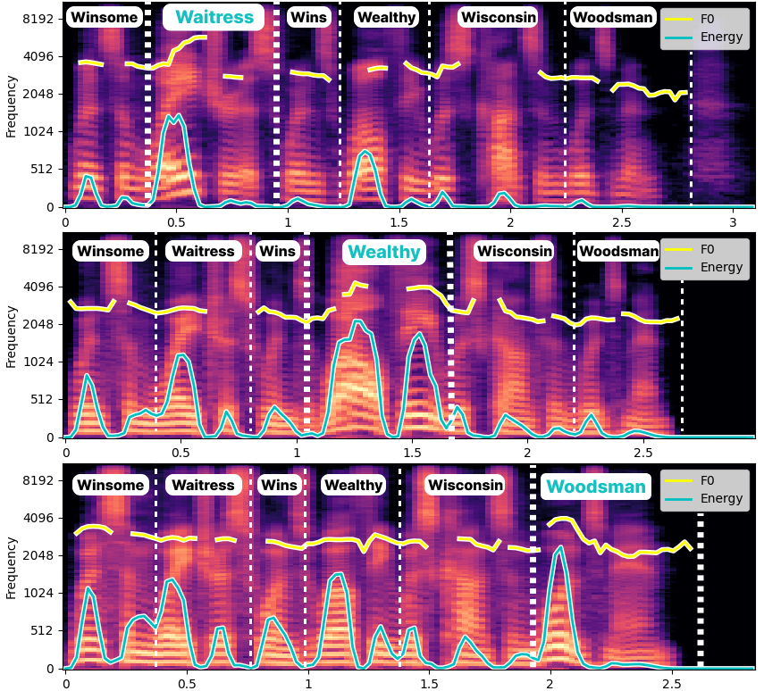

# SpeechCraft: A Fine-Grained Expressive Speech Dataset with Natural Language Description
SpeechCraft is a large-scale expressive bilingual speech dataset with natural language descriptions resulting from an automatic speech annotation system.
It encompasses over 2,000,000 audio clips annotated with two versions of text prompts, called speech Descriptions (exclude transcript) and speech Instructions (include transcript).

We are planning to open source SpeechCraft, making it the laregest natural language stylistic dataset that encompass the most fine-grained attributes and most diverse natural language descriptions available.

## SpeechCraft Dataset Observation

<video width="320" height="240" controls>
  <source src="./userstudy/demo video.mp4" type="video/mp4">
</video>

SpeechCraft is obtained by employing an automatic speech annotation system to four open-source speech datasets. The annotation system adopted various kinds of speech style recognition with LLMs rewriting to form detailed and customized descriptions for expressiveness interpretation. The system framework is illustrated as the video.

### Examples of the speech Descriptions compared with TextrolSpeech

| Audio | Text | TextrolSpeech | Speech Descriptions |
|:-------------|:-------------|:------------------|:------------------|
| <audio controls><source src="./userstudy/2/part2/029.wav" type="audio/mpeg"></audio> |The revolution now under way in materials handling makes this much easier. | The mad male voice is slow and deliberate, with a deep and authoritative pitch. | Speaking with a low pitch and normal volume, a young male with an angry emotion says. His speech is swift yet creating a thought-provoking atmosphere."|
| <audio controls><source src="./userstudy/2/part2/0019_001634.wav" type="audio/mpeg"></audio> |"Hurry up, hurry up!" | Speaking slowly with a high tone, she articulates her amazed words with normal energy. | Urging something with urgency, a surprised teenage female with a high pitch and normal volume impatiently asks.
| <audio controls><source src="./userstudy/2/part2/016.wav" type="audio/mpeg"></audio> | A few years later the dome fell in. | Speaking rapidly and in a normal pitch, the mad man's energy during communication is low. | In a terse and furious tone, a high-pitched teenager with a normal volume and fast speech says. This conversation revolves around a topic related to time, as the speaker expresses their anger.|
| <audio controls><source src="./userstudy/2/part2/0019_001170.wav" type="audio/mpeg"></audio> |Our King George is labourers. | Her low-energy voice carried her sad words gradually, maintaining a normal pitch. |Speaking slowly and plaintively, a woman remarks. With a normal pitch and low volume, she emphasizes the significance of this statement.|
| <audio controls><source src="./userstudy/2/part2/0012_000590.wav" type="audio/mpeg"></audio> | Both side were softly curved. | The man's high-pitched voice resonates through his angry slow-paced speech with regular energy. | Engrossed in an angry conversation, a young boy with a high pitch and a normal volume declares. He is energetic and spoken rapidly, but his heart is heavy with frustration.|

### Examples of the speech Instructions

| Audio | Speech Instructions |
|:-------------|:-------------|
| <audio controls><source src="./userstudy/6/AUD0000001036_S0002432.wav" type="audio/mpeg"></audio> | Entertaining us with her storytelling skills, a natural youth female with high pitch and normal volume speaks rapidly, enthralling us:\"COME INTO THE WATER, MARCUS, SAID JEAN PEREMPTORILY, AS SHE PUT HER FOOT AGAINST THE EDGE OF THE RAFT.\" |
| <audio controls><source src="./userstudy/6/AUD0000001148_S0000872.wav" type="audio/mpeg"></audio> | \"IS IT NOT THAT IT IS THEIR FASHION OF INVESTING THEMSELVES WITH IMPORTANCE?\" This audiobook features a calm, steady-paced speaking male adult with a low pitch and high volume, reflecting on the style of investing. |
| <audio controls><source src="./userstudy/6/POD0000008941_S0000476.wav" type="audio/mpeg"></audio> | Reflecting on a topic in the fields of Health and Fitness, a sad youth with low pitch and normal volume states, \"WELL, YOU KNOW, LIFE IS HOLISTIC, DAVE.\" She speaks at a fast pace, signifying her sadness. |
| <audio controls><source src="./userstudy/6/POD0000009426_S0000120.wav" type="audio/mpeg"></audio> | Expressing happiness, a high-pitched and high-volume female teenager speaker enthusiastically states, \"AND IT'S VERY, VERY IMPORTANT TO ME THAT OUR FAMILY DOESN'T OPERATE LIKE THAT.\" in a fast-paced manner. Speaking in the context of News and Politics, she reflects upon a particular topic, expressing excitement about her words. |
| <audio controls><source src="./userstudy/6/YOU0000012901_S0000187.wav" type="audio/mpeg"></audio> | Expressing joy in the context of Entertainment, a happy adult male with normal pitch and volume speaks rapidly and says, \"I SAYS, I ENJOYED YOUR FILM. THAT'S WHY.\" His words reflect a positive attitude and amiable mood. |
| <audio controls><source src="./userstudy/6/train_SSB05990298.wav" type="audio/mpeg"></audio> | “这个铜牌可以当作生日礼物。”这位年轻女士的音调中等，音量低沉，语速很快。她的语气中透露着内心的自信，还有些得意。 |
| <audio controls><source src="./userstudy/6/train_SSB01120308.wav" type="audio/mpeg"></audio> |“很多著名的流行音乐歌星都因使用毒品而毁了自己。”这位少年女性的音调中等，音量适中，语速很快，语气坚定，语气中带着怀疑和不相信的态度。 |
| <audio controls><source src="./userstudy/6/train_SSB06030260.wav" type="audio/mpeg"></audio> | 男孩的声音很低沉，语气很认真，语气比较平静，有点内敛的感觉，用较高的音量，以较快的语速说：“自被列入十二五规划后。”|
| <audio controls><source src="./userstudy/6/train_SSB03540311.wav" type="audio/mpeg"></audio> | 一位中年女性，她的音调低沉，音量高，语速适中，语气沉稳，镇定得让人感觉安心。她信心满满地说：“全年将有望突破三千亿。”|
| <audio controls><source src="./userstudy/6/train_SSB04340429.wav" type="audio/mpeg"></audio> | 中年男子高分贝，快速地高声说道：“中证房天下大数据指数的推出。”他充满兴奋的语气，反映出他对这个话题话题热衷的态度。|

### Examples of the Regenerated Emphasis Data from AISHELL-3 and Libritts-R (Please refer to Paper Section 4.2)

| Text | Word Emphasis | Regenerated Audio | Speech Instructions |
|:-------------|:-------------|:------------------|:------------------|
| 'It is a story,' Sara would answer. |story| <audio controls><source src="./userstudy/1/6160_44912_000046_000000.wav" type="audio/mpeg"></audio> | Speaking with a natural tone and at a normal speed, a young girl with normal pitch and low volume says, "'It is a story,' Sara would answer.", adding a touch of charm to the conversation, highlighting "story" with pronounced emphasis. |
| That was something over thirteen years ago. |years| <audio controls><source src="./userstudy/1/7247_101864_000028_000002.wav" type="audio/mpeg"></audio> | In an environment where naturalness rules, a calm adult male with normal pitch and low volume speaks rapidly, expressing: "That was something over thirteen years ago.", projecting "years" with significant stress. | 
| Here I can cheaply purchase a delicious self-approval. |self| <audio controls><source src="./userstudy/1/1571_141320_000031_000007.wav" type="audio/mpeg"></audio> | A youthful male with normal pitch and low volume explosively states, "Here I can cheaply purchase a delicious self-approval." He speaks rapidly in a natural manner, drawing attention to "self" by stressing it significantly. |
| Were you born in Spain, Pablo? |Spain| <audio controls><source src="./userstudy/1/1825_135580_000127_000000.wav" type="audio/mpeg"></audio> | A fast-paced conversation with a youth female with low pitch and low volume: "Were you born in Spain, Pablo?", uttering "Spain" with particular stress. |
| 不可以叫住院医师 | 叫 | <audio controls><source src="./userstudy/1/train_SSB00090512.wav" type="audio/mpeg"></audio> | 少女声音略带高昂，音量适中，以缓慢的语速，表达了自己内心的不相信和怀疑，说：“不可以叫住院医师！”，在说“叫”时加大了语气。 |
| 进入前一集 | 进入 | <audio controls><source src="./userstudy/1/train_SSB03090351.wav" type="audio/mpeg"></audio> | 中年女性，声音低沉带有些许忧伤，以低沉的音调，低声说道：“进入前一集。”，确保“进入”被突出地读出。 |
| 男人哭吧不是罪 | 男人 | <audio controls><source src="./userstudy/1/train_SSB02610028.wav" type="audio/mpeg"></audio> | 一位青年男性，声音中等音量，音调中等，语气充满愤怒的发怒，毫不留情地说：“男人哭吧不是罪。”，在“男人”这个词上特别强调。 |
| 如果当时没被抱错 | 被 | <audio controls><source src="./userstudy/1/train_SSB10720450.wav" type="audio/mpeg"></audio> | 年轻女孩的音调很高，音量也非常高，更快速的说出：“如果当时没被抱错。”她的声音中透露着一种不耐烦的情感，在“被”字上进行了强调发音。|

## Experimental Results
### Experimental Results for Expressive Speech Synthesis (Please refer to Paper Section 5.1)

| Style Prompt | Text | Audio (TextrolSpeech) | Audio (SpeechCraft Description Version) |
|:-------------|:-------------|:------------------|:------------------|
| The man employs a deep tone and average speaking speed, projecting an overall low vitality. | A doctor believes this boy to be mad. | <audio controls><source src="./userstudy/5/03_decompressed.wav" type="audio/mpeg"></audio> | <audio controls><source src="./userstudy/5/003.wav" type="audio/mpeg"></audio> |
| The male speaker's energetic discourse is accompanied by a normal pitch and speed. | A doctor believes this boy to be mad. | <audio controls><source src="./userstudy/5/04_decompressed.wav" type="audio/mpeg"></audio> | <audio controls><source src="./userstudy/5/004.wav" type="audio/mpeg"></audio> |
| The man employs a low-pitched voice, keeping a regular rhythm and usual energy in conversation. | A doctor believes this boy to be mad. | <audio controls><source src="./userstudy/5/07_decompressed.wav" type="audio/mpeg"></audio> | <audio controls><source src="./userstudy/5/007.wav" type="audio/mpeg"></audio> |
| Rapidly speaking, the despair man's deep voice resonates with a sense of normal energy. | A doctor believes this boy to be mad. | <audio controls><source src="./userstudy/5/3_decompressed.wav" type="audio/mpeg"></audio> | <audio controls><source src="./userstudy/5/infer-vocos-0102.wav" type="audio/mpeg"></audio> |
| The despair woman's high-pitched voice carried a slow speech. | A doctor believes this boy to be mad. | <audio controls><source src="./userstudy/5/1_decompressed.wav" type="audio/mpeg"></audio> | <audio controls><source src="./userstudy/5/001111.wav" type="audio/mpeg"></audio> |
| The woman's voice is vibrant, high-pitched, and delivered rapidly. | A doctor believes this boy to be mad. | <audio controls><source src="./userstudy/5/08_decompressed.wav" type="audio/mpeg"></audio> | <audio controls><source src="./userstudy/5/008.wav" type="audio/mpeg"></audio> |
| In the context of News and Politics, a calm youth female with normal pitch and high energy describes the details of Felix Sater's forty million dollars pump-and-dump scheme and his cooperation with the government, highlighting their confidential nature. | Like, everything you just heard about felix sater's forty million dollars pump-and-dump scheme and his cooperation with the government goes into a vault. | <audio controls><source src="./userstudy/3/POD0000003712_S0000072 (1).wav" type="audio/mpeg"></audio> | <audio controls><source src="./userstudy/3/POD0000003712_S0000072.wav" type="audio/mpeg"></audio> |
| Surprised by the information, an adult male with normal pitch and energy speaks rapidly, exclaiming,  Their fast speech reflects their astonishment. In the context of Crime, they express their surprise. | Oh, wow! What, what age did that start? | <audio controls><source src="./userstudy/3/POD0000005660_S0000383 (1).wav" type="audio/mpeg"></audio> | <audio controls><source src="./userstudy/3/POD0000005660_S0000383.wav" type="audio/mpeg"></audio> |
| In the midst of a calm and composed atmosphere of Sports, an old male with high pitch and high energy speaks slowly, highlighting the profound emphasis placed on family before the commencement of a race. | You see just how much he was thinking about family before the start of this race. | <audio controls><source src="./userstudy/3/YOU0000001651_S0000741 (1).wav" type="audio/mpeg"></audio> | <audio controls><source src="./userstudy/3/YOU0000001651_S0000741.wav" type="audio/mpeg"></audio> |
| In a somber tone, an adult male with normal pitch and energy speaks slowly about the snow piling up on the streets. | The snow was piling waist high upon the streets. | <audio controls><source src="./userstudy/3/AUD0000000378_S0001201 (1).wav" type="audio/mpeg"></audio> | <audio controls><source src="./userstudy/3/AUD0000000378_S0001201.wav" type="audio/mpeg"></audio> |
| With a low pitch and high energy, a happy adult male enjoying an educational moment exclaimed. His words were spoken at a slow pace, expressing his joy and excitement. This falls under the category of Education. | He was blowing excitedly and running his fingers through his hair. | <audio controls><source src="./userstudy/3/YOU0000000171_S0000745 (1).wav" type="audio/mpeg"></audio> | <audio controls><source src="./userstudy/3/YOU0000000171_S0000745.wav" type="audio/mpeg"></audio> |

### Experimental Results for Fine-Grained Speech Emphasis Control (Please refer to Paper Section 5.2)

| Style Prompt | Word Emphasis | Audio (Instruction Version) |
|:-------------|:-------------|:------------------|
|A youthful male with normal pitch and low volume explosively states, ""Winsome Waitress Wins Wealthy Wisconsin Woodsman."" He speaks rapidly in a natural manner, drawing attention to "Waitress" by stressing it significantly.| Waitress | <audio controls><source src="./userstudy/1/5002.wav" type="audio/mpeg"></audio> |
|A youthful male with normal pitch and low volume explosively states, ""Winsome Waitress Wins Wealthy Wisconsin Woodsman."" He speaks rapidly in a natural manner, drawing attention to "Wealthy" by stressing it significantly.| Wealthy | <audio controls><source src="./userstudy/1/6002.wav" type="audio/mpeg"></audio> |
|A youthful male with normal pitch and low volume explosively states, ""Winsome Waitress Wins Wealthy Wisconsin Woodsman."" He speaks rapidly in a natural manner, drawing attention to "Woodsman" by stressing it significantly.| Woodsman | <audio controls><source src="./userstudy/1/8002.wav" type="audio/mpeg"></audio> |

| Text | Word Emphasis | Audio (Description Version) | Audio (Instruction Version) |
|:-------------|:-------------|:------------------|:------------------|
| 'It is a story,' Sara would answer. |story| <audio controls><source src="./userstudy/1/infer-vocos-0417.wav" type="audio/mpeg"></audio> | <audio controls><source src="./0417.wav" type="audio/mpeg"></audio> |
| That was something over thirteen years ago. |years| <audio controls><source src="./userstudy/1/infer-vocos-0429.wav" type="audio/mpeg"></audio> | <audio controls><source src="./userstudy/1/0429.wav" type="audio/mpeg"></audio> |
| Here I can cheaply purchase a delicious self-approval. |self| <audio controls><source src="./userstudy/1/infer-vocos-0440.wav" type="audio/mpeg"></audio> |  <audio controls><source src="./userstudy/1/0440.wav" type="audio/mpeg"></audio> |
| Were you born in Spain, Pablo? |Spain| <audio controls><source src="./userstudy/1/infer-vocos-0502.wav" type="audio/mpeg"></audio> | <audio controls><source src="./userstudy/1/0502.wav" type="audio/mpeg"></audio> |
| 不可以叫住院医师！ | 叫 | <audio controls><source src="./userstudy/1/infer-vocos-1012.wav" type="audio/mpeg"></audio> | <audio controls><source src="./userstudy/1/1012.wav" type="audio/mpeg"></audio> |
| 进入前一集。 | 进入 | <audio controls><source src="./userstudy/1/infer-vocos-1038.wav" type="audio/mpeg"></audio> | <audio controls><source src="./userstudy/1/1038.wav" type="audio/mpeg"></audio> |
| 男人哭吧不是罪。 | 男人 | <audio controls><source src="./userstudy/1/infer-vocos-1053.wav" type="audio/mpeg"></audio> | <audio controls><source src="./userstudy/1/1053.wav" type="audio/mpeg"></audio> |
| 如果当时没被抱错。 | 被 | <audio controls><source src="./userstudy/1/infer-vocos-1526.wav" type="audio/mpeg"></audio> | <audio controls><source src="./userstudy/1/1526.wav" type="audio/mpeg"></audio> |

### Experimental Results for Automated Speech Style Captioning (Please refer to Paper Section 5.3)

| Audio | Human Annotation from SECap | SECap Caption | Ours | 
|:-------------|:-------------|:------------------|:------------------|
| <audio controls><source src="./userstudy/4/tx_emotion_00203000086.wav " type="audio/mpeg"></audio> | 心情喜悦无比，兴高采烈 | 感到幸福和欢喜 | 一名年轻女性，音调高亢，语速很快，情绪中透露着喜悦和欢喜。|
| <audio controls><source src="./userstudy/4/tx_emulate_00_111_0001_000023.wav " type="audio/mpeg"></audio> | 语气中充满了惊讶，心情分外的愉悦，强压制住心中的喜悦。 | 声音充满了好奇，语气中带着小心翼翼的期待。 | 一位年轻女性，音调高亢，语速适中，带着疑惑和不解的情绪说|
| <audio controls><source src="./userstudy/4/tx_emotion_00302000470.wav " type="audio/mpeg"></audio> | 事事埋怨的感觉 | 很会的样子 | 一名年轻男性，音调高亢，语速快，愤怒地说。|
| <audio controls><source src="./userstudy/4/tx_emulate_02_255_0003_000001.wav " type="audio/mpeg"></audio> | 语调欢快活泼，抑扬顿挫，内心充满惊讶和好奇 | 语调平缓，询问的口吻，流露了疑惑和不解 | 一个年轻女性，音调适中，语速较快，抑扬顿挫地说。|
| <audio controls><source src="./userstudy/4/tx_emulate_01_016_0008_000037.wav " type="audio/mpeg"></audio> | 语气先是急切的，然后转变为迟疑和结结巴巴。| 语气中充满了紧张，心里非常的慌乱，感到害怕。 | 一位年轻女性，音调中等，语速较慢地说。|
| <audio controls><source src="./userstudy/4/tx_emulate_02_008_0011_000058.wav " type="audio/mpeg"></audio> | 心里面满是自责，言语中充满着不愉快，非常的伤心 | 言辞恳切，语气哀伤，心情悲痛 | 一个年轻女性，音调高亢，语速适中，带着不悦的情绪说。|
| <audio controls><source src="./userstudy/4/tx_emotion_00206000061.wav  " type="audio/mpeg"></audio> | 好奇心所致，保持疑惑，想要知道答案。 | 对某件事有疑心，和不解 | 一位年轻女性的音调高亢，语速适中，心有所疑虑地说。|         

| Audio | Annotation from the automatic system | Automated Speech Style Captioning |
|:-------------|:-------------|:------------------|
| <audio controls><source src="./userstudy/4/POD0000001256_S0000303.wav" type="audio/mpeg"></audio> | Expressing angry in the domain of news and politics, an old male with a normal pitch and energy speaks rapidly. | says an angry adult male with normal pitch and volume, speaking at a fast pace. This conversation takes place in the context of News and Politics.
| <audio controls><source src="./userstudy/4/YOU0000001807_S0000305.wav" type="audio/mpeg"></audio> | Delving into the world of Education, a cheerful young woman with low pitch and high energy enthusiastically explains. | A happy teenage girl with normal pitch and high volume speaks slowly, expressing her thoughts in an educational setting.
| <audio controls><source src="./userstudy/4/AUD0000000487_S0000797.wav" type="audio/mpeg"></audio> | Embarking on a narration in an audiobook, a sad teenage female with a normal pitch and normal energy sets the stage with a poignant line. | In the context of an audiobook, a teenage girl with normal pitch and volume speaks at a moderate speed, conveying her thoughts.
| <audio controls><source src="./userstudy/4/AUD0000000116_S0000440.wav" type="audio/mpeg"></audio>  | With a sense of angry, an adult male with normal pitch and energy speaks slowly in an audiobook setting, describing a scene. | In the context of an audiobook, a natural adult male with normal pitch and volume speaks at a slow pace.
| <audio controls><source src="./userstudy/4/POD0000005252_S0000022.wav" type="audio/mpeg"></audio>  | Reflecting on the alleviation or disappearance of symptoms after a fast, a calm elderly male with a high pitch and slow speaking speed shares the observation. | expresses a natural old male with normal pitch and high volume, speaking at a slow pace.
| <audio controls><source src="./userstudy/4/POD0000000648_S0000020.wav" type="audio/mpeg"></audio>  | Expressing sadness in the context of News and Politics, a calm adult female with normal pitch and energy speaks slowly about racial anguish, saying. | says a sad adult female with normal pitch and volume, speaking at a slow pace in the context of News and Politics.
| <audio controls><source src="./userstudy/4/POD0000001248_S0000334.wav" type="audio/mpeg"></audio>  | With high energy and a slow pace, a happy female youth with normal pitch conveys her thoughts.  Her words reflect a positive and optimistic outlook. (Category. News and Politics) | expresses a sad adult female with normal pitch and high volume, speaking at a slow pace in the context of News and Politics.